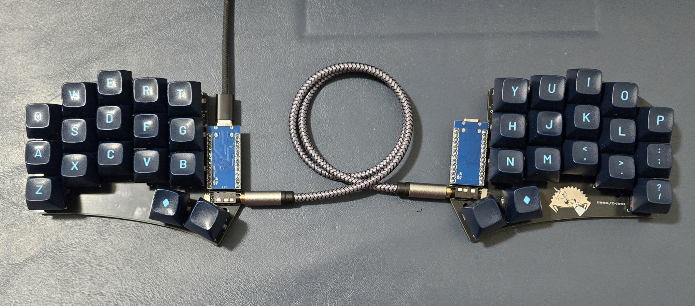

# QMK Keyboard
A custom-built mechanical keyboard, programmed using [QMK firmware](https://qmk.fm/).

## Overview
After my hands started experiencing irritation after repeated movements I found that a more ergonomic keyboard could help me. I was drawn to the ergonomics and form-factor of a small split-keyboard. The customizability of both hardware (with hot-swappable mechanical switches and microcontroller) and firmware (with the fully programmable nature of QMK). What started as the beginnings of hand pain ended with a superb melding of electromechanical design.

## Key Technologies

| Programming Language | Hardware                                                    |
| -------------------- | ----------------------------------------------------------- |
| - C (QMK)            | - Hand-soldered PCB   - MCU   - Mechanical Switches |

## Features / Capabilities
- Hot-swappable mechanical switches
- Colemak and QWERTY layouts
- Fully independant left- and right-hand sides
- 54-key layout with layers for modifier, function, symbol, and number keys
- Hand-soldered PCB
- Millmax sockets enable microcontroller to be easily swapped

## What I Learned
- How to use an existing embedded firmware solution to customize my hardware layout
- Creating a functional design based upon initial requirements
- Better understanding of concepts of and interactions between hardware, firmware, and software
- Role of client preference (in this case--my own) in engineering design
